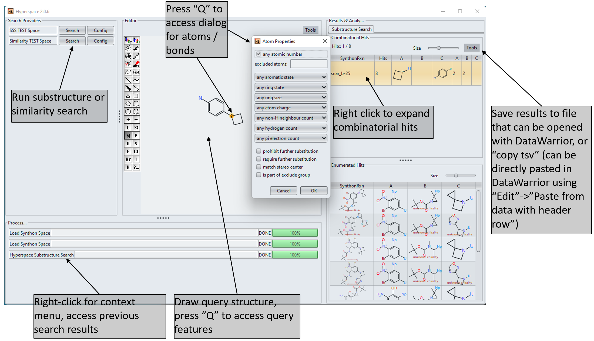

[](https://github.com/Actelion/openchemlib-hyperspace/actions/workflows/maven.yml)

# openchemlib-hyperspace
Cheminformatics tools, workflows and pipelines for substructure search, virtual screening and data analysis


# First Steps -  Substructure search in a toy combinatorial library space
The following six steps are required to try out the fast substructure search in combinatorial library spaces. In this example we create the necessary datastructures from a provided input file containing a toy combinatorial library space consisting of 30k structures.

1. Download and build with maven, i.e. just use "mvn package", or alternatively import into Intellij and execute the maven task "mvn package"

2. A successful build should create the .jar file  openchemlib-hyperspace-cli/target/openchemlib-hyperspace-cli.jar , check that it exists

3. Switch to the example subfolder and copy the openchemlib-hyperspace-cli.jar file in there

4. Create hyperspace data file from example space file "idorsia_toy_space_a.txt". This is a virtual library that we used for validation of the algorithms. It contains a few synthon reactions and in total around 30k structures, i.e. it is easily possible to compare search results of Hyperspace against normal enumerated search.

   To do this use the following command:
 
   java -jar openchemlib-hyperspace-cli.jar CREATESPACE idorsia_toy_space_a.txt test FragFp 2
 
   Explanation of the parameters after CREATESPACE: (1) input file name (2) name of the space that you want to create (determines the output file name) (3) descriptor name (must be FragFp for substructure search), (4) number of threads for space creation.
 
5. Start the GUI for interactive search in our toy space

    java -jar openchemlib-hyperspace-cli.jar GUI hyperspace_test_config.json

6. Try out some queries using OpenChemLib query features, e.g. "foA@@@DjU_YVgKNBBJ@@@@vpA``". Please check the section Hyperspace GUI Manual below for instructions on how to use the software.

You can now run substructure searches against the 30k structures.



## Synthon downsampling CLI

After building the CLI module you can reduce large synthon sets (e.g. before downstream workflows) via the new `SynthonSpaceDownsamplingCLI`:

```
java -cp openchemlib-hyperspace-cli/target/openchemlib-hyperspace-cli.jar \
    com.idorsia.research.chem.hyperspace.cli.SynthonSpaceDownsamplingCLI \
    --spaceIn hyperspace.data \
    --rawOut hyperspace_downsampled.rawspace.gz \
    --maxCenters 8 \
    --minSimilarity 0.75 \
    --seed 13 \
    --threads 4
```

`--spaceIn` expects a serialized `SynthonSpace`. The optional parameters configure the SkelSpheres-based k-centers routine (max representatives per synthon set, similarity cut-off, shuffling seed, connector grouping). If you point the CLI to a raw dump via `--rawIn toy.rawspace`, it now runs a native raw downsampler (`SkelSpheresKCentersRaw`) without hydratring a full `SynthonSpace`, then persists the representatives back into a new raw file alongside the existing metadata. Downsampled spaces are always emitted as raw dumps (plain `.rawspace` or compressed `.rawspace.gz`), so the same file can be reused by the seed finder, local optimizer, and any future processors.
`--threads` controls how many synthon sets are downsampled in parallel. For size-aware caps you can add `--sizeCapScale` and `--sizeCapOffset` to apply `ceil(scale * sqrt(n) + offset)` per set; the effective cap is `min(--maxCenters, sizeCap)` when both are provided.

## Raw synthon space import CLI

You can parse vendor TSV files (e.g. Enamine REAL) or folders of per-reaction CSV files into lightweight `RawSynthonSpace` dumps before running heavier tooling. While importing you may attach arbitrary descriptor tags via repeated `--descriptorTag FragFp` (or comma-separated lists); these tags are stored as metadata and describe which descriptor families the fragments are compatible with. Multiple tags are only supported when you write the raw JSON (i.e. without `--synthonOut/--similarityOut` in the same run).

```
java -cp openchemlib-hyperspace-cli/target/openchemlib-hyperspace-cli.jar \
    com.idorsia.research.chem.hyperspace.cli.RawSynthonSpaceImportCLI \
    --format enamine \
    --input idorsia_toy_space_a.txt \
    --spaceName toy \
    --mode FragFp \
    --threads 4 \
    --rawOut toy.rawspace.gz \
    --synthonOut toy_FragFp.data
```

```
java -cp openchemlib-hyperspace-cli/target/openchemlib-hyperspace-cli.jar \
    com.idorsia.research.chem.hyperspace.cli.RawSynthonSpaceImportCLI \
    --format csv \
    --directory /data/new_space \
    --spaceName newspace \
    --mode FragFp \
    --smilesColumn SMILES \
    --idColumn bb1_parent_id \
    --priceColumn Price \
    --priceAttribute price.usd \
    --synthonSetColumn SynthonSet \
    --rawOut newspace.rawspace.gz
```

The CSV mode (powered by `SynthonSpaceParser3`) assumes one file per reaction; each row provides a synthon SMILES plus metadata (IDs, optional price, optional synthon-set index). Column names are configurable via CLI flags, and numeric metadata such as prices are stored as fragment attributes inside the raw space, ready for downstream cost-aware workflows. `--mode` mirrors the descriptors understood by the parser (FragFp, PathFp, mode_pfp, mode_ffp, mode_ppcore). Besides the JSON dump you can optionally persist a `SynthonSpace` and/or similarity side-car in one go. `--rawOut` is required and can point to either `.rawspace` or `.rawspace.gz` (compression is inferred from the extension).

## Process RawSynthonSpace

Once a raw dump exists you can enrich it with additional metadata (e.g. precomputed descriptors) without leaving the lightweight format:

You can store raw dumps either as human-readable `.rawspace` files or as compressed `.rawspace.gz`. The CLI automatically detects the extension when reading or writing files.

```
java -cp openchemlib-hyperspace-cli/target/openchemlib-hyperspace-cli.jar \
    com.idorsia.research.chem.hyperspace.cli.RawSynthonSpaceProcessorCLI \
    --rawIn toy.rawspace \
    --rawOut toy_with_desc.rawspace.gz \
    --descriptor FragFp \
    --descriptor SkelSpheres \
    --threads 8
```

`RawSynthonSpaceProcessorCLI` writes a new JSON file so the pristine import stays unchanged. Each requested descriptor is serialized per fragment (under `descriptor.<shortName>` attributes) and tagged in the raw metadata, enabling downstream workflows (seed finding, downsampling, 2D/3D optimizers) to operate directly on enriched raw dumps.

## Build SynthonSpace from RawSynthonSpace

Once a raw dump exists you can regenerate a full `SynthonSpace` or similarity space without re-parsing the vendor source:

```
java -cp openchemlib-hyperspace-cli/target/openchemlib-hyperspace-cli.jar \
    com.idorsia.research.chem.hyperspace.cli.RawSynthonSpaceBuildCLI \
    --rawIn toy.rawspace \
    --synthonOut toy_FragFp.data \
    --similarityOut toy_FragFp_similarity3.data
```

When materializing a `SynthonSpace` you must explicitly provide `--descriptor` (e.g. `FragFp`, `PathFp`, `mode_pfp`, `mode_ffp`, `mode_ppcore`). The build CLI recomputes the descriptor from the raw fragments for the chosen mode, so you can run it multiple times—once per descriptor tag—without re-parsing the vendor sources. Use `--bits` to override descriptor length and `--skipValidation` to bypass connector checks if the raw dump was already validated.

## Query-aware seed finder CLI

Given a downsampled synthon space you can launch the query-aware seed finder that assembles random molecules and filters them with PheSA:

```
java -cp openchemlib-hyperspace-cli/target/openchemlib-hyperspace-cli.jar \
    com.idorsia.research.chem.hyperspace.cli.SynthonSeedFinderCLI \
    --raw hyperspace_downsampled.rawspace.gz \
    --output hits.tsv \
    --querySmiles "c1ccc(cc1)NC(=O)N" \
    --attempts 5000 \
    --minAtoms 20 \
    --maxAtoms 60 \
    --maxRotBonds 15 \
    --minPhesa 0.65
```

Each TSV line contains the reaction id, the contributing synthon identifiers, the assembled IDCode, atom counts, rotatable bond counts, and the PheSA similarity.

## Local beam optimization CLI

Given a seed TSV (from the seed finder) you can run the local stochastic optimization routine. Supply either a downsampled synthon space (restricts swaps) or a full synthon space file:

```
java -cp openchemlib-hyperspace-cli/target/openchemlib-hyperspace-cli.jar \
    com.idorsia.research.chem.hyperspace.cli.SynthonLocalOptimizerCLI \
    --seeds seeds.tsv \
    --output optimized.tsv \
    --space my_space.data \
    --querySmiles "c1ccc(cc1)NC(=O)N" \
    --beam 10 --topL 100 --sampleNeighbors 10 --cap 2 --rounds 6 --patience 3 --minPhesa 0.65 --seedThreads 4 --log IMPROVEMENTS
```

The optimizer keeps a beam of the best assemblies while sampling top-L SkelSpheres neighbors per synthon, assembling each candidate, and rescoring with the 3D PheSA alignment. The output TSV mirrors the seed format with an additional `seedFragIds` column that records the starting tuple.

## Continuous screening CLI

If you prefer a single executable that samples seeds, optionally performs a lightweight optimization on the downsampled representatives, and continuously feeds the best candidates into the full optimizer, launch the continuous screening workflow:

```
java -cp openchemlib-hyperspace-cli/target/openchemlib-hyperspace-cli.jar \
    com.idorsia.research.chem.hyperspace.cli.ContinuousScreeningCLI \
    --rawFull hyperspace.rawspace.gz \
    --rawDownsampled hyperspace_downsampled.rawspace.gz \
    --querySmiles "c1ccc(cc1)NC(=O)N" \
    --candidateThreshold 0.65 \
    --fullMinSimilarity 0.6 \
    --fullThreads 8 \
    --queueCapacity 1000 \
    --progressSeconds 60 \
    --reactionWeightExponent 1.0 \
    --reactionMinWeight 0.01 \
    --outputHits screening_hits.tsv \
    --iterations 10000
```

By default the CLI keeps looping until the requested iteration budget is exhausted (use `--iterations -1` for an open-ended run). `--fullMinSimilarity` controls the minimum PheSA similarity that a local-optimization candidate must reach to be reported. `--queueCapacity` controls how many sample+optimize jobs can wait in the executor queue before backpressure kicks in. `--progressSeconds` sets the interval for periodic progress logging (0 disables). `--reactionWeightExponent` dampens or amplifies reaction size weighting (1.0 = proportional to candidate count), and `--reactionMinWeight` sets the minimum weight fraction for small reactions. Add `--microEnabled` together with the `--micro*` parameters if you want a short downsampled-space LocalBeamOptimizer pass before scheduling the full optimization stage.

# Build
## General

Maven is used as build tool.
The project is organized as a Maven project "openchemlib-hyperspace" containing a number of different submodules.
The parent project has a fixed version "DEV-snapshot" / "dev".
The actual version of the different submodules is specified via the propery ${revision}.

# Submodules

**hyperspace-core**
Provides datastructures and algorithms to represent and search in combinatorial libraries (aka. synthon spaces).

**hyperspace-core-gui**
Provides GUI elements and server/client tools that enable search / virtual screening.  

**hyperspace-tools**
Contains tools to parse combinatorial libraries in synthon representation and create the hyperspace data files.

**hyperspace-sar**
Coming soon.

# hyperspace-core

Provides algorithms and datastructures to represent combinatorial libraries in synthon representation. Provides algorithms for fast fingerprint filtering, enabling fast substructure searching in enumerated libraries. Provides full algorithm for substructure searching in enumerated libraries. Provides implementations of similarity search algorithms for combinatorial libraries.

Most important classes:
com.idorsia.research.chem.hyperspace.SynthonSpace
Serializable class that represents a combinatorial library in synthon representation. Provides methods for fast substructure search.

com.idorisa.research.chem.hyperspace.SynthonSimilaritySpace3
Serializable class that extends a SynthonSpace by methods for similarity searching.

# hyperspace-core-gui
Provides a basic extendable GUI to provide search functionality. The GUI can be extended by implementing "search providers" that provide GUI and logic for searching. Contains default implementations for hyperspace similarity and substructure search. The GUI also provides tools to help with the implementation of server / client based searching. It further contains a substructure search service that provides substructure search capability for the datawarrior hyperspace substructure plugin.

## Hyperspace Server Manual

Example launch of server

`java -Xmx16G -jar <path_to_hs_server_jar> com.idorsia.research.chem.hyperspace.gui.HyperspaceServer -t <num_threads_per_query> -s <max_num_simultaneous_queries> -p <port> --init <path_to_json_config_file>`

`java -Xmx16G -jar <path_to_hs_server_jar> com.idorsia.research.chem.hyperspace.gui.HyperspaceServer -t 12 -s 4 -p 8090 --init server_config.json`

The file server_config.json just contains the different available search services. A search service has a specific specific search service name, the serviceProvider must be specified and the configuration for the service provider must be provided.

```
{
   "ServiceProviders":[
      {
         "ServiceName":"REAL Space SSS",
         "ServiceProvider":"HyperspaceSSS",
         "Config":{
            "SpaceName":"REAL Space",
            "File":"/home/liphath1/hyperspace_base_2/data_hyperspace/REAL_Space_latest_FragFp.data",
            "MaxNumberOfThreads":-1
         }
      },
      {
         "ServiceName":"Idorsia VCS 3.2 (2S) SSS",
         "ServiceProvider":"HyperspaceSSS",
         "Config":{
            "SpaceName":"IVCS 3 (2S)",
            "File":"/home/liphath1/hyperspace_base_2/data_hyperspace/ivcs3_2s_FragFp.data",
            "MaxNumberOfThreads":-1
         }
      },
      {
         "ServiceName":"REAL Space SSS DWService",
         "ServiceProvider":"HyperspaceSSSForDW",
         "Config":{
            "SpaceName":"REAL Space",
            "File":"/home/liphath1/hyperspace_base_2/data_hyperspace/REAL_Space_latest_FragFp.data"
         }
      }
   ]
}
```


## Hyperspace GUI Manual


Example launch of GUI:

`java -Xmx16G -jar <path_to_hyperspace_server_jar> com.idorsia.research.chem.hyperspace.gui.HyperspaceSearchGUI <path_to_json_config_file>`

The structure of the config file for the GUI is the same as for the server, i.e. it is a list of service provider configurations. There are remote service providers available, that allow to send queries to a hyperspace server. The "SearchServiceName" has to agree with the configured service name of the service provider running on the server.

Example Standard (local) configuration

Exactly the same as the configuration of the server (however, only search providers that provide a GUI can be used, but most search providers do).

Example Remote configuration

```
{
   "ServiceProviders":[
      {
         "ServiceName":"REAL Space SSS",
         "ServiceProvider":"HyperspaceSSSRemote",
         "Config":{
            "Server":"hyperspaceserver",
            "Port":"8090",
            "SearchServiceName":"REAL Space SSS",
            "GUIServiceName":"REAL Space SSS"
         }
      },
      {
         "ServiceName":"IVCS3 2S SSS",
         "ServiceProvider":"HyperspaceSSSRemote",
         "Config":{
            "Server":"hyperspaceserver",
            "Port":"8090",
            "SearchServiceName":"Idorsia VCS 3.2 (2S) SSS",
            "GUIServiceName":"IVCS 3 (2s) SSS"
         }
      },
      {
         "ServiceName":"REAL Space Sim",
         "ServiceProvider":"HyperspaceSimilarityRemote",
         "Config":{
            "Server":"hyperspaceserver",
            "Port":"8090",
            "SearchServiceName":"REAL Space Similarity",
            "GUIServiceName":"REAL Space Similarity"
         }
      },
      {
         "ServiceName":"IVCS3 2S Sim",
         "ServiceProvider":"HyperspaceSimilarityRemote",
         "Config":{
            "Server":"hyperspaceserver",
            "Port":"8090",
            "SearchServiceName":"Idorsia VCS 3.2 (2S) Similarity",
            "GUIServiceName":"IVCS 3 (2s) Similarity"
         }
      }
   ]
}
```

# hyperspace-tools

Provides tools to create the hyperspace data files that can be loaded by the search providers of the tools in hyperspace-server.

Example for parsing / creating hyperspace data files for substructure search:

`java -Xmx16G  com.idorsia.research.chem.hyperspace.io.SynthonSpaceParser2 /home/liphath1/hyperspace_base_2/data/REAL_Space_latest/2021-02_REAL_synthons_SMALL.txt <name_of_space_file> FragFp <number_of_threads>`


This creates a synthon space with "FragFp" descriptors. This is the descriptor / space that is necessary for the substructure search services.

The input file format is a tsv (tab separated values) file with the following format:
first line is header line (and is not parsed)
all other lines are:
1. synthon in smiles, 2. a synthon id, 3. an integer specifying the synthon set of the synthon reaction, 4. the synthon reaction

i.e. the following file would create two synthon reactions, each with two synthon sets (synthon reaction r1 has 2x2 synthons, synthon reaction r2 has 1x3 synthons to assemble). Of course the synthons must have matching connectors (i.e. matching transuranium elements (atomic mass 92-99), that uniquely identify each possible connection point). All synthons of a synthon set of a reaction must have the same connectors (i.e. a single U, or Np and Pu, etc.). The correctness of synthons is checked during the creation of the datastructures and in case of problems, the software will output error messages for the problematic synthons / synthon reactions. 

```
smiles   synthon  synton#   reaction_id
smiles1	r1_1_s1	1	r1
smiles2	r1_1_s2	1	r1
smiles3	r1_2_s1	2	r1
smiles4	r1_2_s2	2	r1
smiles5	r2_1_s1	1	r2
smiles6	r2_2_s1	2	r2
smiles7	r2_2_s2	2	r2
smiles8	r2_2_s3	2	r2
```

# Developers
- Thomas Liphardt
